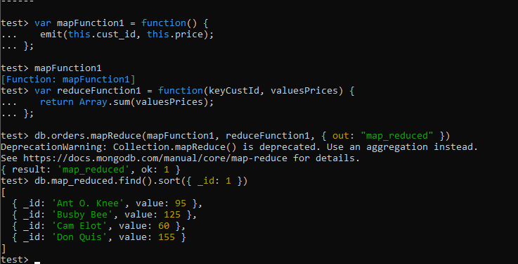

## DAT250: Software Technology Experiment Assignment 3

### Experiment 1:

I went through the interactive mongodb web tutorial.
Then I downloaded MongoDB4.4 installer and verified the checksum:

The checksum matched, so I installed the software and set it up as a Windows service.

Then I downloaded MongoShell and added it to PATH.

I went through all the CRUD operations and did the examples:

### Experiment 2:
I added the customer data from the Map Reduce example:

Map reduce example of sum of products bought per customer:

Map reduce that calculates the average price of items bought per customer.
I defined a new mapFunction to extract the price of each product (ignoring the quantity) and taking the average of the array in the reduceFunction.

Average of items with counting quantity:

This map reduce function might be useful for a quick customer analysis. 
It might indicate what type of people are shopping, given by the price-point of which that they are buying things at.
I also made this example so that I could experiment with using and extracting 'deeper' JSON list variables.

### Issues:
- The mapReduce function is not working when used inside the Mongodb Compass console. I got it to finally work by using 'mongosh' in a cmd shell instead.