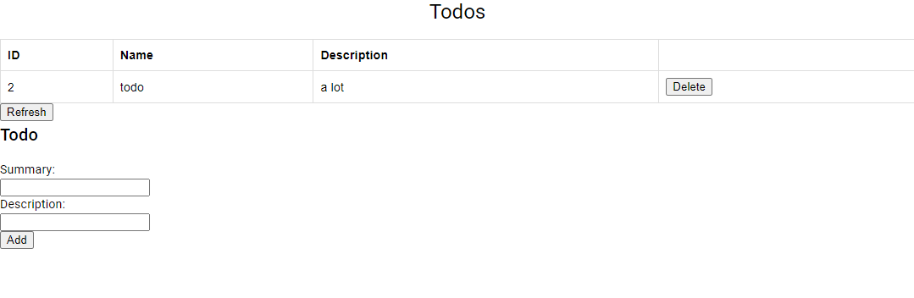
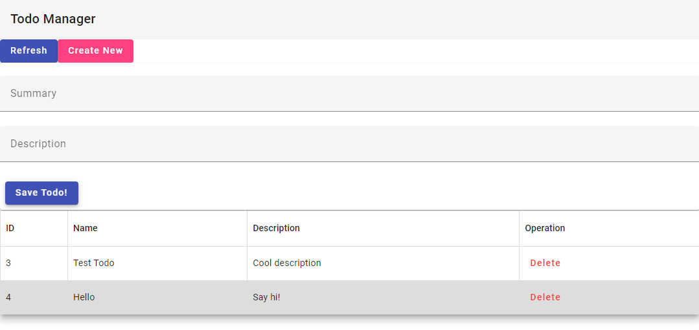

## DAT250: Software Technology Experiment Assignment 6

### Code repositories: 
* Angular App: https://github.com/Veggissss/dat250expass6
* Todo REST server: https://github.com/Veggissss/dat250expass4

### Experiment 1:
* I managed to create a service to communicate with the REST todo server
* A component that forwards input/interactions and displays it by using the html and css provided.

### Experiment 2:
* This is what I ended up with, by using Angular Material:

### Technical problems:
* I had trouble getting my REST requests to stopped being blocked:
* XMLHttpRequest at 'http://localhost:8080/todos' from origin 'http://localhost:4200' has been blocked by CORS policy.
* I fixed it by allowing the angular origin in the springboot application by adding a mapping in the CorsRegistry. 
